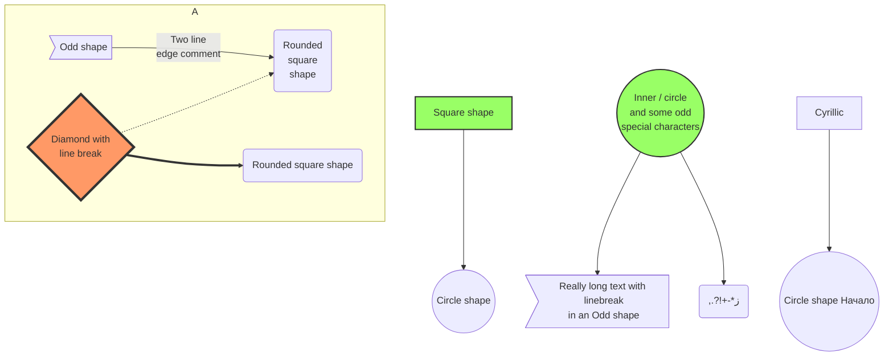
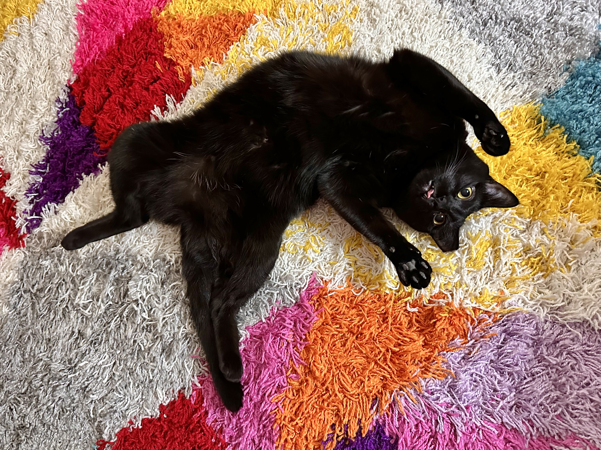

This is a demo of some of the Astro features available to this website.

## Generate the Table of Contents

```markdown
## Table of Contents
```

## Table of Contents

# 1# Header

In this website, it should not be used because it conflicts with the page's existing `<h1>`.

## 2# Header

### 3# Header

#### 4# Header

##### 5# Header

###### 6# Header

## Footnotes w/ Return

```markdown
First footnote[^1] and second footnote.[^2]

[^1]: ["First"](https://astro.build)
[^2]: ["Second"](https://astro.build)
```

First footnote[^1] and second footnote.[^2]

[^1]: ["First"](https://astro.build)
[^2]: ["Second"](https://astro.build)


## Table

```markdown
| One | Two | Three |
| --- | --- | ----- |
| A   | B   | C     |
```

| One | Two | Three |
| --- | --- | ----- |
| A   | B   | C     |

## Math

### Inline

```latex
$$
\mathrm{e} = \sum_{n=0}^{\infty} \dfrac{1}{n!}
$$
```

$$
\mathrm{e} = \sum_{n=0}^{\infty} \dfrac{1}{n!}
$$

### Code Block

```
    ```math
    \mathrm{e} = \sum_{n=0}^{\infty} \dfrac{1}{n!}
    ```
```

```math
\mathrm{e} = \sum_{n=0}^{\infty} \dfrac{1}{n!}
```

## LibertinusKeyboard Ligatures

```html
To get to the menu, type <span class="keyboard">Ctrl</span> + <span class="keyboard">3</span>

<span class="keyboard">Ctrl Enter Shift Space + </span>
```

To get to the menu, type <span class="keyboard">Ctrl</span> + <span class="keyboard">3</span>

<span class="keyboard">Ctrl Enter Shift Space + </span>

## Mermaid

```markdown
    ```mermaid
    graph TB
        sq[Square shape] --> ci((Circle shape))

        subgraph A
            od>Odd shape]-- Two line<br/>edge comment --> ro
            di{Diamond with <br/> line break} -.-> ro(Rounded<br>square<br>shape)
            di==>ro2(Rounded square shape)
        end

        %% Notice that no text in shape are added here instead that is appended further down
        e --> od3>Really long text with linebreak<br>in an Odd shape]

        %% Comments after double percent signs
        e((Inner / circle<br>and some odd <br>special characters)) --> f(,.?!+-*ز)

        cyr[Cyrillic]-->cyr2((Circle shape Начало));

        classDef green fill:#9f6,stroke:#333,stroke-width:2px;
        classDef orange fill:#f96,stroke:#333,stroke-width:4px;
        class sq,e green
        class di orange
        ```
```



## Semantic Blockquote & Cite

```markdown
> "Semantic \<blockquote\> & \<cite\>"
> 
> <cite>Jean Ralphio, On Grapes</cite>
```

> "Semantic \<blockquote\> & \<cite\>"
> 
> <cite>Jean Ralphio, On Grapes</cite>

## Semantic Aside

Inspired by [GitHub](https://github.com/orgs/community/discussions/16925).

```markdown
> [!NOTE]
> Hello
> 
> <br>
> 
> newline with gap!
>

> [!TIP]
> Hello
> 
> newline
> without gap.

> [!IMPORTANT]
> Important
>

> [!WARNING]
> Warning

> [!CAUTION]
> Caution
```

> [!NOTE]
> Hello
> 
> <br>
> 
> newline with gap!
>

> [!TIP]
> Hello
> 
> newline
> without gap.

> [!IMPORTANT]
> Important
>

> [!WARNING]
> Warning

> [!CAUTION]
> Caution

## Images

```markdown

```


