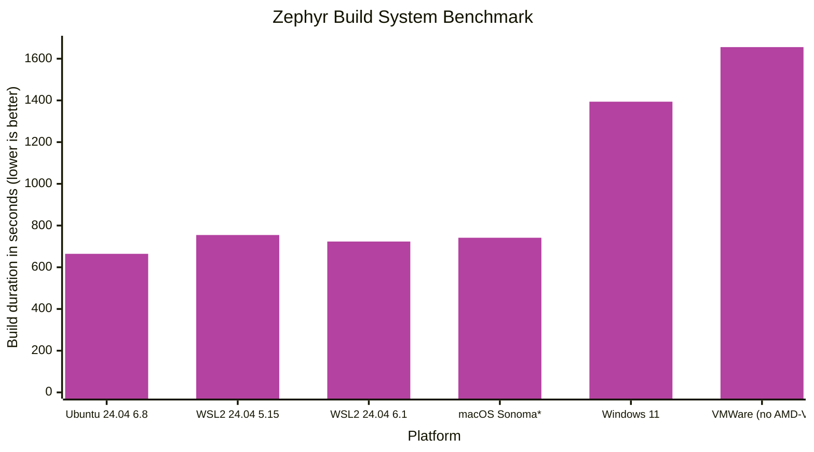

 

About a year and a half ago, I decided to take a different approach to setting up a Zephyr environment for a new project at [Intercreate](https://www.intercreate.io/). Instead of using my trusty VMWare Workstation Linux VM, I opted for WSL2. I was curious to find out: Would hardware pass-through for debugging work reliably? Would all of the tooling dependencies be supported? What about build system performance?

Not only did everything go smoothly, but since then, many colleagues have also moved from native Linux or traditional VMs to WSL2 and seen great results.

[Continue reading at the Interrupt...](https://interrupt.memfault.com/blog/comparing-fw-dev-envs)