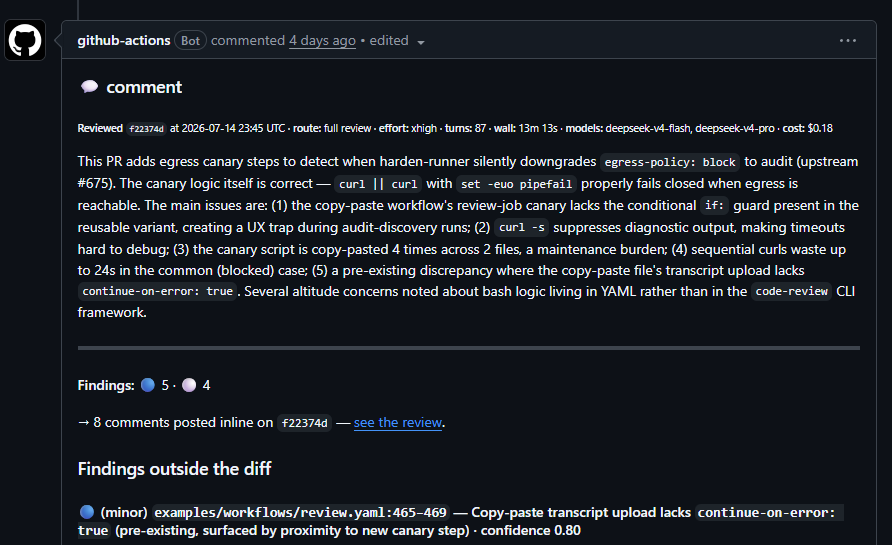

---
title: Would You Pay $1 for Agentic Code Review on PRs?
author: JP Hutchins
date: 2026-07-19
tags: [oss, ai, llm, github, ci-cd, "code review"]
preview: "LLM-driven code reviews in CI/CD have become common SASS offerings, but where does that leave open source software projects? Here's an approach to regain complete control of the harness, models, and cost."
---	

It might surprise people that I'm investing time in LLM tooling -- "Agentic" tooling even -- because I've always been somewhat of an AI-skeptic. But, this [`code-review`](https://github.com/JPHutchins/code-review) project is not my first foray into the category; I am also working on a task runner called [`camas`](https://github.com/JPhutchins/camas) that optionally includes an MCP and skills, and indeed it was used for the development of `code-review`. In turn `camas` now benefits from `code-reviews`'s agentic review on every PR.

Perhaps I am more of an "AI-industry" skeptic, or wary of hype and fear-mongering, than I am skeptical of LLMs themselves. I am not convinced that "AI agents" can replace engineers, or any occupation, really. I can only speak for my experience as a software engineer -- the frontier models like Opus and Fable 5 are particularly well-suited for writing software, and on their own, _I don't think they're that good at it_. But I'm not sticking my head in the sand either. My experience is that LLMs, when bounded by expert judgement and deterministic checks, provide an incredible, [albeit hard to quantify](https://sloanreview.mit.edu/article/three-approaches-to-measuring-and-managing-ai-roi/), boost to the pace of development and testing. One category where I'm very happy with their utility is code review, particularly _agentic code review_.

Lately, I've started to dread what a post-AI-bubble or post-token-subsidy world would look like. Will models that provide affordable inference survive? How will Open Source Software (OSS) projects benefit from LLMs if contributors are no longer able to use subsidized flat-rate plans?

## Agentic Code Review

Some definitions are in order since "agentic" is a bit of a buzz word.

### Peer Code Review

Let's relate everything back to what code review means to you. In order to review the code, you must first _read_ the code -- additions and removals -- and you may choose to also _interact_ with the code. Interacting with the code would require copying (pulling) the changes to your local development environment and then fiddling with it: running the test suite, running the library or application, modifying code as you do so, and in my line of work -- something that an LLM agent cannot do -- flashing firmware to a physical device and interacting with it. The process uses aspects of engineering, design, quality assurance (QA), testing, and writing.

The kind of review that is _read-only_ -- an audit of changes -- is like a **"Static LLM Code Review"**. A review that interacts with -- or even modifies -- the code is like an **"Agentic LLM Code Review"**.

### Static LLM Code Review

This is a relatively cheap approach to automated code review because it only _reads_. It's also easy to implement: just pipe your `git diff` into an API chat prompt and ask for a review. There are many examples of ready made GitHub Actions to do this and it's simple enough that you can do it yourself (something that will be a theme in this post.)

Some may claim that this is agentic because the chatbot _could_ do things like make web searches to validate claims. Nonsense: those are other aspects of a standard read-only code review.

Still others might call an LLM doing this sort of review "static analysis", to which I disagree fervently. Static analysis is something that software engineers are already familiar with and it is a _deterministic_ routine to assess some qualities of the software. LLMs are _stochastic_ not deterministic so they cannot perform what we traditionally consider static analysis...

### Agentic LLM Code Review

...unless those LLMs are given access to the deterministic tools that do perform static analysis. This is the realm of **Agentic Code Review** and it's something that I have been quite impressed by ever since my first use of Claude Code's absolute token incinerator of a command: `/code-review`.

An agentic code review uses a harness (like Claude Code) and can run compilers, linters, launch parallel subagents in worktrees, modify the code to confirm hypotheses, research dependencies, check for CVEs, possibly even _interact with the application_ (though not on physical hardware for us firmware engineers 🤖).

Where a static LLM code review may come back in a few minutes after consuming less than 1M tokens, an agentic review may go on for tens of minutes, or even an hour, using 5M tokens and beyond. Which is why you'll see Anthropic advertise this service as costing \$15-\$25 per PR. And frankly, I could see this going out to $100 eventually, based on the hour+ `/code-review` sessions I've run locally.

In my experience, these agentic reviews reliably surface real, sometimes quite subtle, findings. And that's what we want. But how can we enable agentic code review at an affordable cost for OSS?

## Open Source Models

**tl;dr it's DeepSeek v4**



I'm not going to claim to understand API token pricing, but what I will claim is that as long as [DeepSeek is offering the rate](https://api-docs.deepseek.com/quick_start/pricing/) they do on input cache hits, DeepSeek v4 Pro/Flash are an incredible value for this kind of open source agentic code review and it's what I've been experimenting with for the last couple of weeks.

Here is an actual cost table from an [actual agentic code review on an actual PR](https://github.com/JPHutchins/camas/pull/204#issuecomment-4983946462): **$0.20 for a 14m 54s** run.

> [!WARNING]
> **LLM Disclosure**
> 
> This review was produced by deepseek-v4-flash, deepseek-v4-pro.
>
> | Model | Input | Output | Cache read | Cache write | Cost |
> |---|--:|--:|--:|--:|--:|
> | deepseek-v4-flash | 325,348 | 220,690 | 3,961,088 | 0 | $0.12 |
> | deepseek-v4-pro | 102,004 | 35,709 | 2,427,904 | 0 | $0.08 |
> | **Total** | **427,352** | **256,399** | **6,388,992** | **0** | **$0.20** |
>
> _Generated by [code-review](https://github.com/JPHutchins/code-review) · [view the run & traces](https://github.com/JPHutchins/camas/actions/runs/29439132586)._

DeepSeek has no charge for Cache write (AFAIK, please correct me if I'm wrong) and an incredible discount on DeepSeek v4 Pro Cache read of $0.003625/MTok, leading to an affordable review for open source.

> [!IMPORTANT] DeepSeek Platform
>
> You must use [DeekSeek's own API tokens and inference infrastructure](https://platform.deepseek.com/) to get this deal on cache. If you want to use these models through OpenRouter, I recommend setting up DeepSeek for Bring Your Own Key (BYOK) and disabling other inference providers for DeepSeek models.

### Wait... where's the API key? How is it safe from forks? And how was that code review produced?

Basically I _wanted_ this thing, and in the era of practically free inference on frontier models, I will admit that the implementation and spec is written by an LLM.

_Wait, no, don't leave!_

Because there is not a precedent for agentic code review on public repos, not to mention implementation of granular time and cost constraints, I decided that the first step was to produce a Minimum Viable Product (MVP) and set it loose in the wild. If I had worked on it without LLM assistance, I'd still be drafting the spec and validating GitHub Actions security boundaries instead of publishing a write up.

## [code-review](https://github.com/JPHutchins/code-review)

### What the MVP reference implementation accomplishes

- **Mitigates risk of leaking your API token** by triage, network egress lock, and structured rendering (but you do need to use a burner key with a small amount on it, to be safe).
- **CI-reactive review paths:**
  - On CI success, launches the "full review".
  - On CI failure, launches a minimal "mechanic" review meant to guide contributors to correct mistakes. Optional, can just do no review on CI failure to avoid sinking cost.
- **Structured review output:**
  - Each review will meet requirements because it is generated from markdown templates, **not an LLM's whims**.
  - The LLM delivers review in a JSON document that has been **schema validated**.
  - LLMs reading the review are directed to that JSON document, not GH API + markdown parsing.
- Deterministic(-ish!) **time and cost limits** on the agentic review. _This was by far the most difficult aspect of development and stands to be improved -- harness improvements would have the biggest impact here._
- **Start from a GH comment** like `/code-review $0.25 Make sure to check that all docs were updated`
  - Limit the ability to start a code review to **trusted repository members**.
  - Control costs, time limits, and review focus for **iterative PR phases**.
- **Full control**:
  - change the harness
  - change the models
  - change the prompts
  - change the supporting tooling
  - change the provided context (feed it the CI test reports, for example)
- **Incremental re-reviews**: the system reads previous review JSONs to jump-start the review context
- **Traceability -- the entire review transcript is uploaded**

All of that is accomplished with [markdown templates](https://github.com/JPHutchins/code-review/tree/main/templates), and the reference [review-reusable.yaml](https://github.com/JPHutchins/code-review/blob/main/.github/workflows/review-reusable.yaml), and the [`code-review` helper tool](https://github.com/JPHutchins/code-review/tree/main/src).

> _Calling 5K lines of TS with 10K lines of supporting tests a **"helper"** might mean I'm finally vibe-pilled_ 🤦‍♀️.

### You Can Try it Now

> [!CAUTION] Use a "burner API key" with a small allocation of funds.

1. Create a `review.yaml` in your GitHub repo that imports `code-review`'s [review-reusable.yaml](https://github.com/JPHutchins/code-review/blob/main/.github/workflows/review-reusable.yaml) and sets the [options](https://github.com/JPHutchins/code-review/blob/58b5de8fc769a98917e981a664ba829bfd11b4a4/.github/workflows/review-reusable.yaml#L11-L158).
2. Add `.github/prices.json` to get cost estimates for your reviews.
3. Add the `MODEL_API_KEY` secret to your repo (your deepseek platform API key).
4. Once this is present on main, your next PR into main will trigger the review workflow.

> [!TIP] Worked Example from [camas](https://github.com/JPHutchins/camas/blob/main/.github/workflows/review.yaml)
>
> ```yaml
> name: Code review
> 
> on:
>   workflow_run:
>     workflows: ["CI"] # must match the regular test workflow that triggers this
>     types: [completed]
> 
> permissions:
>   contents: read
>   actions: read
>   pull-requests: write
>   issues: write
>
> jobs:
>   review:
>     # customize your conditions for a review run
>     if: >-
>       github.event.workflow_run.event == 'pull_request' &&
>       (github.event.workflow_run.conclusion == 'success' ||
>        github.event.workflow_run.conclusion == 'failure')
>
>     # import code-review's review-reusable
>     uses: JPHutchins/code-review/.github/workflows/review-reusable.yaml@v0.1. 0-alpha.25
>
>     with:
>       # required boiler plate to link this review to the PR
>       # this is part of the threat model mitigation
>       head_sha: ${{ github.event.workflow_run.head_sha }}
>       head_branch: ${{ github.event.workflow_run.head_branch }}
>       head_repo: ${{ github.event.workflow_run.head_repository.full_name }}
>       run_id: ${{ github.event.workflow_run.id }}
>       conclusion: ${{ github.event.workflow_run.conclusion }}
>       trigger_event: ${{ github.event.workflow_run.event }}
>
>       # your chosen api base and models
>       api_base_url: "https://api.deepseek.com/anthropic"
>
>       # optional environment setup for agentic tool use
>       install_command: |
>         pipx install --force uv==0.9.15
>         PIPX_BIN="$(pipx environment --value PIPX_BIN_DIR)"
>         echo "$PIPX_BIN" >> "$GITHUB_PATH"
>         export PATH="$PIPX_BIN:$PATH"
>         echo "UV_PYTHON_DOWNLOADS=never" >> "$GITHUB_ENV"
>         UV_PYTHON_DOWNLOADS=never uv sync --python 3.12
>
>       # review-reusable locks down network egress by default
>       extra_endpoints: pypi.org:443 files.pythonhosted.org:443 release-assets.githubusercontent.com:443
>
>       # model options
>       model_mechanic: deepseek-v4-flash
>       mechanic_time_limit: 3m
>       mechanic_grace_period: 90s
>       mechanic_usd_limit: $0.05
>
>       model_full: deepseek-v4-pro
>       full_review_time_limit: 24m
>       full_review_grace_period: 12m
>       full_usd_limit: $1.00
> 
>     # your API key
>     secrets:
>       MODEL_API_KEY: ${{ secrets.MODEL_API_KEY }}
> ```
>
> [prices.json](https://github.com/JPHutchins/camas/blob/main/.github/prices.json)
> ```json
> {
>   "_updated": "2026-07-05",
>   "_unit": "USD per 1M tokens",
>   "models": {
>     "deepseek-v4-pro": { "in": 0.435, "out": 0.87, "cache_read": 0.003625, "cache_write": 0.0 },
>     "deepseek-v4-flash": { "in": 0.14, "out": 0.28, "cache_read": 0.0028, "cache_write": 0.0 }
>   }
> }
> ```

### The spec

So that's the reference implementation that anyone can try out today, but the core of the repository is the idea itself, characterized in this [spec.md](https://github.com/JPHutchins/code-review/blob/main/SPEC.md) document. I hope that this proof-of-concept inspires others to work in this category. And of course contribution to [code-review](https://github.com/JPHutchins/code-review) is welcome!

I don't know how the market-side could work, and I don't know how much inference is going to cost in the long run, but personally I would share my open source projects as training data in exchange for reduced token rates.

Here are some highlights of what the specification document defines and how the MVP went about realizing them.

### GitHub Actions & Public Forks

Briefly, there are real security vulnerabilities created by allowing public forks to open a pull request that triggers github actions.

There are two primary concerns in the case of enabling agentic code review.

1. Secret exfiltration. You at least need to have an API token as a GitHub secret, so that's a likely target. Open a PR that modifies the GitHub workflow to print the secret to the log, then use it to pay for inference.
2. Spoofing. Using our API token to ask the LLM to do some malicious behavior, or just plain stealing your inference for themselves.

In GitHub terms, the way that `code-review` mitigates risk is by _running the workflow from main_, not from the untrusted fork. This means that in the review context, the repository source code is unmodified by the PR's changes. So how do we we run the review of the PR if we're on main, not the branch corresponding to the PR?

1. Checkout main.
2. Install our `code-review` helper tool (described above) and Claude Code from npm.
3. Run the users own environment setup steps.
4. Lock network egress to a short trusted list.
5. Run the security triage: a Claude Code agent evaluates the diff of the PR, with a tiny subset of tools available, and determines whether the PR is safe for a full agentic review, as true or false. This is not without risk, which is why it's important for open source repositories to use API keys with small amounts on them -- $5.00 -- so that API key leakage is not a catastrophe. I am inviting everyone to *try to break it on my own repositories* by opening PRs against them with prompt injections.
6. Run the agentic review, branching on the result of CI. You could always just not even start this review workflow if CI fails. Or you can run a $0.05 review to help a new contributor understand why CI failed for them.
7. Validate the JSON schema of the review.
8. Generate the review comments from the JSON + templates and post them to the PR.
9. Upload the review JSON and full transcripts.

I'm not pretending it's simple. It's a 700+ line YAML file and that's after abstracting lots of stuff in the `code-review` helper app. But let's jump to the spelled out threat model so that we're not GitHub-centric.

### Threat Model

The most important part of the specification is the threat model and suggestions for mitigation.

#### Assets

There are the assets shared with _anyone who creates a PR from a fork_.

- **Model API key** — spends money; the primary target.
- **Write credential** — can modify the repository or its conversation; the secondary target.
- **Reviewer runtime** — transient, but its environment holds the model key.

#### Threats

| Threat                                                                                      | Why it matters                                                                                              | Control                                                                                                                                               |
| ------------------------------------------------------------------------------------------- | ----------------------------------------------------------------------------------------------------------- | ----------------------------------------------------------------------------------------------------------------------------------------------------- |
| Untrusted content hijacks the reviewer (direct or indirect prompt injection)                | The reviewer reads author-controlled text by design ([OWASP LLM01][llm01]; [NIST][nist])                    | The reviewer holds no write/publish credential and no open egress; its worst output is a public comment (§2.2)                                        |
| Reviewer is induced to exfiltrate the model key or environment secrets                      | The "lethal trifecta" turns injection into exfiltration ([Willison][trifecta])                              | Read-only credential; egress allowlist ([StepSecurity][harden]); burner key with hard spend cap; public comment is the sole accepted residual channel |
| Untrusted change runs in a privileged context (pwn request / poisoned pipeline execution)   | A documented, high-impact CI class ([GitHub Security Lab][pwn]; [OWASP][ppe]; [Gil & Krivelevich][ppeorig]) | The privileged (write) role never executes the change; the trigger and reviewed commit come from CI, not author content                               |
| Output carries a payload aimed at the maintainer (phishing, "ignore previous instructions") | A finding is untrusted text shown to a human                                                                | Rendered as data by a host that neutralizes active content; the commenter escapes all untrusted text (defense in depth)                               |
| Output smuggles a second, conflicting result to flip the verdict                            | Appending an extra block could mask the real one                                                            | Recovery accepts exactly one validating candidate; ambiguity fails closed (§3.2)                                                                      |
| A fork redirects the review to the wrong target                                             | Author-controlled routing would misattribute the review                                                     | Target resolved from the trusted commit identifier (+ branch), never from author-controlled data                                                      |
| A prior review is spoofed to suppress a real one                                            | A copied marker could impersonate the bot                                                                   | Prior state trusted by **authenticated author identity**, not by any marker (§3.3)                                                                    |
| Spend runaway / denial-of-wallet                                                            | Repeated pushes could burn budget                                                                           | Burner key + hard spend cap; run timeout; cancel superseded runs                                                                                      |
| Tampered deliverable in transit between roles                                               | The write role must not act on forged data                                                                  | Transport integrity is provided by the CI platform; the write role only deserializes, never executes                                                  |

[llm01]: https://genai.owasp.org/llmrisk/llm01-prompt-injection/
[trifecta]: https://simonwillison.net/2025/Jun/16/the-lethal-trifecta/
[nist]: https://csrc.nist.gov/pubs/ai/100/2/e2025/final
[pwn]: https://securitylab.github.com/resources/github-actions-preventing-pwn-requests/
[seclab4]: https://securitylab.github.com/resources/github-actions-new-patterns-and-mitigations/
[prtarget]: https://docs.github.com/en/actions/reference/security/securely-using-pull_request_target
[events]: https://docs.github.com/en/actions/reference/workflows-and-actions/events-that-trigger-workflows
[ghsec]: https://docs.github.com/en/actions/security-for-github-actions/security-guides/security-hardening-for-github-actions
[ghtoken]: https://docs.github.com/en/actions/writing-workflows/choosing-what-your-workflow-does/controlling-permissions-for-github_token
[ppe]: https://owasp.org/www-project-top-10-ci-cd-security-risks/CICD-SEC-04-Poisoned-Pipeline-Execution
[ppeorig]: https://medium.com/cider-sec/ppe-poisoned-pipeline-execution-34f4e8d0d4e9
[harden]: https://docs.stepsecurity.io/github-actions/harden-runner
[tjcve]: https://github.com/advisories/GHSA-mrrh-fwg8-r2c3
[unit42]: https://unit42.paloaltonetworks.com/github-actions-supply-chain-attack/
[codecov]: https://about.codecov.io/security-update/
[leastpriv]: https://csrc.nist.gov/glossary/term/least_privilege

## Conclusion

I will continue to use `code-review` on my own OSS projects since I've already seen it catch issues that slipped by local review and my own ("static") review. The maintenance workflow for it tends to be pretty simple to manage:

- Notice a problem with a review? Point an agent to the review and ask it to create an issue, including links to the comment and run, on the `code-review` repo.
- Assign one or more issues to an agent that will create a PR on `code-review`.
- Instruct that agent to wait on `code-review`'s automated CI + code reviews, and iterate.

Looking forward to seeing more users and bug reports, or new systems based on the threat mitigations demonstrated. Good luck!